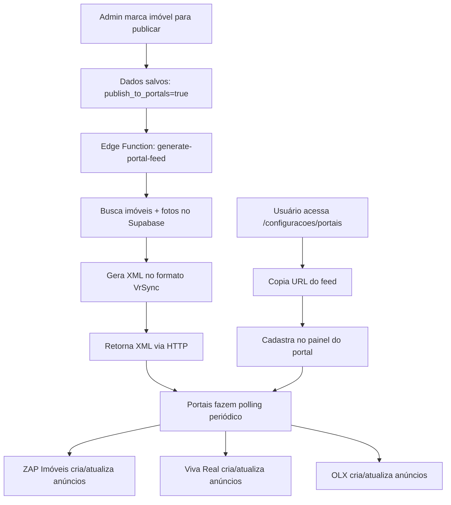

## 🎯 Plano de Implementação: Integração com Portais Imobiliários

### **Fase 1: Preparação do Banco de Dados**

**1.1. Criar campos de controle de publicação na tabela `properties`**
```sql
ALTER TABLE properties ADD COLUMN publish_to_portals BOOLEAN DEFAULT false;
ALTER TABLE properties ADD COLUMN portal_listing_id TEXT;
ALTER TABLE properties ADD COLUMN portal_last_sync TIMESTAMP;
ALTER TABLE properties ADD COLUMN portal_status TEXT; -- 'draft', 'published', 'error'
ALTER TABLE properties ADD COLUMN transaction_type TEXT; -- 'sale', 'rent', 'both'
```

**1.2. Criar tabela de configuração de portais por conta**
```sql
CREATE TABLE portal_integrations (
  id UUID PRIMARY KEY DEFAULT gen_random_uuid(),
  account_id UUID REFERENCES accounts(id) NOT NULL,
  provider TEXT NOT NULL, -- 'grupozap', 'olx', etc
  is_active BOOLEAN DEFAULT true,
  ad_limit INTEGER, -- limite de anúncios do plano contratado
  featured_limit INTEGER, -- limite de destaques
  credentials JSONB, -- credenciais específicas do portal
  feed_url TEXT, -- URL única do feed XML desta conta
  created_at TIMESTAMPTZ DEFAULT now(),
  updated_at TIMESTAMPTZ DEFAULT now()
);
```

**1.3. Criar tabela de logs de sincronização**
```sql
CREATE TABLE portal_sync_logs (
  id UUID PRIMARY KEY DEFAULT gen_random_uuid(),
  account_id UUID REFERENCES accounts(id),
  property_id UUID REFERENCES properties(id),
  portal TEXT,
  action TEXT, -- 'create', 'update', 'delete'
  status TEXT, -- 'success', 'error'
  error_message TEXT,
  synced_at TIMESTAMPTZ DEFAULT now()
);
```

### **Fase 2: Edge Function para Geração do Feed XML**

**2.1. Criar Edge Function `generate-portal-feed`** (pública, sem autenticação)
```typescript
// supabase/functions/generate-portal-feed/index.ts
// Recebe account_id como query param
// Gera XML VrSync com imóveis marcados para publicação
// Retorna XML com Content-Type: application/xml
```

**Lógica da função:**
- Receber `account_id` via query param (?account_id=xxx)
- Buscar configuração da conta em `portal_integrations`
- Buscar imóveis com `publish_to_portals = true` e `account_id` correspondente
- Para cada imóvel:
  - Buscar fotos do bucket público `property-photos`
  - Gerar URLs públicas para fotos
  - Formatar dados no formato VrSync
- Retornar XML completo seguindo especificação VrSync
- Registrar log em `portal_sync_logs`

**2.2. Configurar função no `supabase/config.toml`**
```toml
[functions.generate-portal-feed]
verify_jwt = false  # Precisa ser público para os portais acessarem
```

### **Fase 3: Interface de Gestão de Anúncios**

**3.1. Criar página `/imoveis/anuncios`**

Componentes principais:
- **Tabela de imóveis** com colunas:
  - Checkbox de seleção
  - Foto do imóvel
  - Nome/Endereço
  - Tipo de transação (venda/aluguel)
  - Status nos portais (badge colorido)
  - Última sincronização
  - Ações (publicar/despublicar)

**3.2. Modificar card de imóvel em `PropertiesList.tsx`**
- Adicionar botão "Anúncios" que já existe (linha 298-301)
- Tornar funcional: abrir drawer com opções de portais
- Incluir toggle rápido "Publicar nos Portais"

**3.3. Criar `PortalManagementDialog` component**
```tsx
// src/components/Properties/PortalManagementDialog.tsx
// Permite configurar:
// - Quais portais publicar (ZAP, Viva Real, OLX)
// - Tipo de transação (venda/aluguel)
// - Destaque/Super destaque
// - Preview do XML que será gerado
```

### **Fase 4: Painel de Configuração de Portais**

**4.1. Criar página `/configuracoes/portais`**

Funcionalidades:
- **Card ZAP Imóveis**: Toggle ativar/desativar + limite de anúncios
- **Card Viva Real**: Toggle ativar/desativar + limite de anúncios  
- **Card OLX**: Toggle ativar/desativar + limite de anúncios
- **URL do Feed XML**: Campo de texto readonly com botão copiar
  - Exemplo: `https://[project].supabase.co/functions/v1/generate-portal-feed?account_id=[id]`
- **Instruções**: Como cadastrar o feed nos portais

**4.2. Adicionar ao Sidebar**
```tsx
// Em src/components/Layout/Sidebar.tsx
// Adicionar item "Portais Imobiliários" na seção Configurações
```

### **Fase 5: Sistema de Monitoramento**

**5.1. Criar Dashboard de Sincronização**
- **KPIs**:
  - Total de imóveis publicados
  - Sincronizações com sucesso/erro nas últimas 24h
  - Limite de anúncios usado vs disponível
  - Última sincronização por portal

**5.2. Notificações de Erros**
- Alertar quando sincronização falhar
- Email quando limite de anúncios for atingido
- Toast de sucesso quando publicar/despublicar

### **Fase 6: Otimizações e Features Avançadas**

**6.1. Sincronização Manual**
- Botão "Sincronizar Agora" para forçar update imediato
- Útil para testar ou atualizar dados urgentemente

**6.2. Agendamento de Publicações**
- Campo `publish_start_date` e `publish_end_date`
- Permite agendar início e fim de campanhas

**6.3. Analytics de Portais**
- Se os portais oferecerem API de estatísticas:
  - Views por imóvel
  - Leads gerados
  - Taxa de conversão

**6.4. Integração com Contatos/Leads**
- Quando lead vier de portal, identificar origem
- Criar registro em `contacts` automaticamente
- Associar conversas de WhatsApp ao imóvel de origem

---

## 🏗️ Arquitetura Técnica Resumida



---

## 🎨 Vantagens Competitivas vs Kenlo

1. **Feed XML Automático**: Sem necessidade de intervenção manual
2. **Multi-Portal Unificado**: Gerencia ZAP, Viva Real e OLX em um só lugar
3. **Monitoramento em Tempo Real**: Dashboard com status de sincronização
4. **Limite de Anúncios Inteligente**: Alertas quando atingir limite do plano
5. **Preview do XML**: Usuário vê exatamente o que será enviado
6. **Logs Completos**: Rastreabilidade total de publicações/erros

---

## 📦 Deliverables Prioritários

### **MVP (Essencial para Venda)**
1. ✅ Campo `publish_to_portals` na tabela properties
2. ✅ Edge Function `generate-portal-feed` funcional
3. ✅ Página `/configuracoes/portais` com URL do feed
4. ✅ Botão "Publicar nos Portais" nos cards de imóveis
5. ✅ Documentação de como cadastrar feed nos portais

### **Fase 2 (Diferencial Competitivo)**
6. Dashboard de sincronização com KPIs
7. Sistema de notificações de erros
8. Portal Management Dialog completo
9. Página dedicada `/imoveis/anuncios`

### **Fase 3 (Premium Features)**
10. Analytics de portais
11. Integração com leads dos portais
12. Agendamento de publicações

---

## ⚠️ Considerações Importantes

1. **Fotos Públicas**: As fotos já estão no bucket `property-photos` (público) ✅
2. **URLs Permanentes**: Garantir que URLs das fotos não mudem após publicação
3. **Performance**: Cache do XML por 15-30 minutos para evitar queries excessivas
4. **Validação**: Validar dados antes de gerar XML (campos obrigatórios do VrSync)
5. **Multi-Tenant**: Cada account_id tem seu próprio feed XML isolado ✅
6. **Documentação**: Criar guia passo-a-passo de como cadastrar nos portais

---

## 🚀 Estimativa de Esforço

- **Fase 1 (MVP)**: 2-3 dias de desenvolvimento
- **Fase 2 (Dashboard)**: 1-2 dias  
- **Fase 3 (Analytics)**: 2-3 dias (se APIs disponíveis)

**Total MVP funcional**: ~3 dias para ter feature competitiva contra Kenlo.

